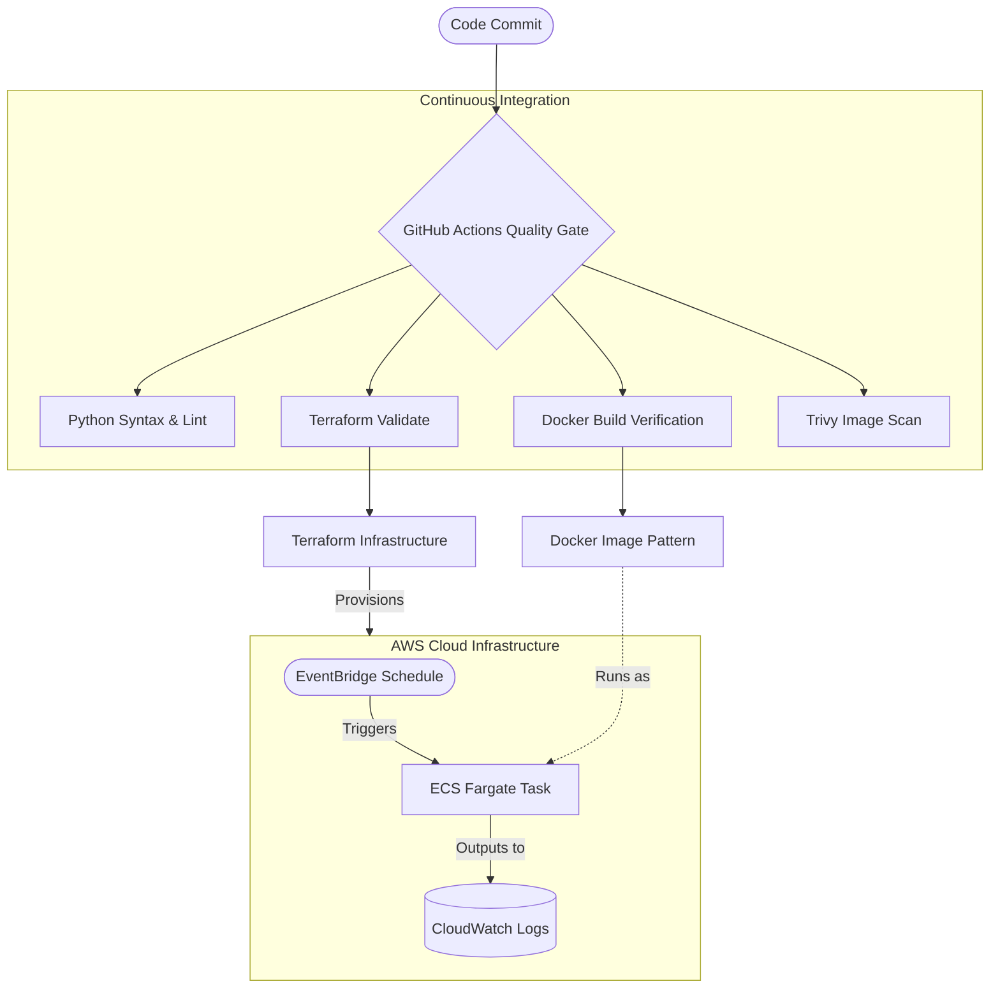

[](https://github.com/stokie2605/cloud-native-task-automator/actions/workflows/ci-cd.yml)

# Cloud-Native Task Automator

Cloud-Native Task Automator is a DevOps portfolio project that provisions the AWS infrastructure for a scheduled containerized health-check task. It combines Python automation, Docker, Terraform, ECS Fargate, EventBridge scheduling, IAM least privilege, and GitHub Actions validation into one cloud-native workflow.

The project demonstrates how a small operational script can be packaged, validated, scanned, and prepared for scheduled execution in AWS.

## Recruiter Snapshot

| Area | What This Project Shows |
| --- | --- |
| Automation | Python health-check utility with structured JSON logs and configurable target endpoint |
| Containers | Multi-stage Docker build, slim Python 3.12 runtime image, dependency isolation, package-tool stripping, non-root execution |
| Infrastructure as Code | Terraform-defined AWS provider, VPC, IAM roles, ECS task, CloudWatch logs, and EventBridge schedule |
| CI/CD | GitHub Actions quality gate for Python linting, Terraform validation, Docker build, and Trivy scanning |
| Cloud Operations | Scheduled serverless task pattern suitable for uptime checks, internal probes, and operational evidence |

## Problem

Operational teams often need small recurring checks: poll a health endpoint, verify an internal service, emit logs, and fail clearly when something is wrong. Running those checks manually is inconsistent, and running them from a workstation creates weak auditability.

## Solution

This repository turns a Python health-check script into a cloud-native scheduled task pattern:



## Architecture

The Terraform configuration models a deployable AWS runtime:

- VPC with public/private subnet structure.
- ECS Fargate cluster and task definition.
- CloudWatch log group for task output.
- EventBridge schedule that runs the task every 12 hours.
- IAM execution, runtime, and schedule invocation roles using least-privilege boundaries.
- Configurable health-check target URL and container image URI.

## DevOps Skills Demonstrated

- Built a Python CLI-style automation task with clean exit codes and JSON-formatted logs.
- Containerized the script with a multi-stage Dockerfile, a patched Python 3.12 runtime, stripped package-management tooling, and a non-root runtime user.
- Declared AWS infrastructure with Terraform instead of manual console setup.
- Added GitHub Actions checks for Python, Terraform, Docker, and image vulnerability scanning.
- Configured Trivy as a blocking image security gate for `HIGH` and `CRITICAL` vulnerabilities.
- Documented the path from local script to scheduled ECS Fargate workload.

## Key Files

| File | Purpose |
| --- | --- |
| `task_automator.py` | Python health-check task with structured logging and clear success/failure exit codes |
| `requirements.txt` | Pinned Python dependencies for local and container execution |
| `Dockerfile` | Multi-stage Python 3.12 image build with stripped package tooling and non-root runtime user |
| `.github/workflows/ci-cd.yml` | CI/CD quality gate for linting, Terraform validation, Docker build, and Trivy scan |
| `terraform/providers.tf` | Terraform and AWS provider constraints |
| `terraform/variables.tf` | Configurable AWS region, environment, container image, and health-check target URL |
| `terraform/vpc.tf` | Isolated networking foundation for ECS task execution |
| `terraform/iam.tf` | IAM roles for ECS execution, task runtime, and scheduled invocation |
| `terraform/ecs_schedule.tf` | ECS Fargate task, CloudWatch logging, and EventBridge schedule |
| `docs/walkthrough.md` | Guided reviewer walkthrough for interview or portfolio review |

## Automated Testing

The repository contains a `pytest` suite that verifies the health check utility logic:
- Fetch target URL environment overrides.
- Poll endpoint success and failure behaviors (using mocked HTTP responses).
- JSON log formatter schema structure and details.
- Health check execution exit codes (success, HTTP errors, timeouts).

To run the unit tests locally:
1. Install testing requirements:
   ```bash
   pip install -r requirements.txt -r requirements-dev.txt
   ```
2. Execute `pytest`:
   ```bash
   python -m pytest
   ```

The GitHub Actions CI pipeline runs these tests automatically on every push.

## Local Run

Install dependencies and run the health check locally:

```bash
pip install -r requirements.txt
python task_automator.py
```

Override the default target endpoint:

```bash
HEALTHCHECK_TARGET_URL=https://example.com/health python task_automator.py
```

## Docker Run

Build and run the containerized task:

```bash
docker build -t cloud-native-task-automator .
docker run --rm cloud-native-task-automator
```

Run against a custom endpoint:

```bash
docker run --rm \
  -e HEALTHCHECK_TARGET_URL=https://example.com/health \
  cloud-native-task-automator
```

## Terraform Validation

Validate the infrastructure configuration without creating AWS resources:

```bash
cd terraform
terraform init -backend=false
terraform fmt -check -recursive
terraform validate
terraform plan
```

Before applying in a real AWS account, replace `container_image` with an ECR image URI that points to a published image.

## CI/CD Quality Gate

The GitHub Actions workflow runs on pushes and pull requests to `main`:

- Python dependency installation and flake8 syntax checks.
- Terraform formatting and validation.
- Docker Buildx image build verification.
- Trivy scan blocks the build on `HIGH` and `CRITICAL` image vulnerabilities.

## Production Extension Path

Next production-grade additions would be:

- Add an ECR repository and authenticated image push workflow.
- Add AWS OIDC federation for GitHub Actions instead of long-lived credentials.
- Add a gated Terraform plan/apply workflow for controlled infrastructure changes.
- Store health-check results in CloudWatch metrics or a lightweight datastore.
- Private AWS service endpoints now support Fargate image pulling and telemetry: ECR API, ECR Docker, CloudWatch Logs interface endpoints, plus an S3 gateway endpoint on private route tables. NAT remains in place for the external health-check target, but AWS control-plane traffic no longer depends solely on internet egress.
- Send failures into Slack, Teams, PagerDuty, or ticketing workflows.
- Maintain a documented CVE baseline if any future image exception is deliberately accepted.

## Problems Faced & Solved

**Problem: A simple health-check script risks looking too small unless the deployment pattern around it is clear**
The core Python task is intentionally lightweight - the value is in how it is packaged, scheduled, and validated. Without the surrounding infrastructure, it could look like a basic script rather than a cloud-native workload pattern.

**Solution:** Packaged the script as a Dockerized ECS task, modelled the full AWS runtime using Terraform (ECS cluster, task definition, EventBridge schedule, IAM role with least-privilege permissions), and added GitHub Actions CI with Trivy security scanning. This demonstrates the complete path from a simple script to a production-grade scheduled cloud workload - which is the real skill being shown.

---

**Problem: Private Fargate tasks need reliable AWS service access for image pulls and logs**
Scheduled tasks run in private subnets with `assign_public_ip = false`. NAT routing already provided internet egress, but ECR image pulls, S3 layer access, and CloudWatch Logs delivery were still coupled to outbound internet infrastructure.

**Solution:** Added VPC endpoints for ECR API, ECR Docker, CloudWatch Logs, and S3. This keeps AWS platform traffic on private AWS networking while retaining NAT for the configured external health-check URL.


---

**Problem: Report-only Trivy scans allowed vulnerable images to pass CI**
The Docker image scan previously used `exit-code: '0'`, which meant the workflow could stay green even if Trivy found high or critical vulnerabilities in the image.

**Solution:** Changed the Trivy gate to `exit-code: '1'` and scoped the severity filter to `HIGH,CRITICAL`, so genuine exploit-level findings fail CI immediately without creating noise from lower-severity package advisories. When the stricter gate exposed runtime image findings, the Dockerfile was upgraded to Python 3.12, the direct HTTP dependency was patched, and `pip`/`setuptools`/`wheel` were stripped from the final runtime layer after dependency installation.

## Reviewer Notes


- Environment template: [.env.example](.env.example)
- Sample task log: [docs/sample-task-output.json](docs/sample-task-output.json)
- Deployment notes: [docs/DEPLOYMENT_NOTES.md](docs/DEPLOYMENT_NOTES.md)

